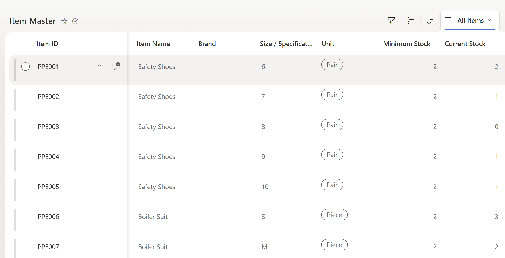
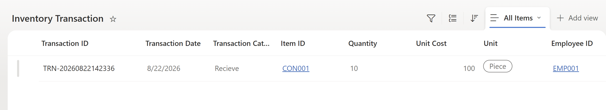

# 📦 Power Platform Inventory Management System

An end-to-end Inventory Management System developed using **Microsoft Power Apps, Power Automate, SharePoint, and Power BI** to digitize inventory transactions, automate stock calculations, and provide management-level inventory insights.

## 🎯 Project Objective

The objective of this project is to replace manual inventory tracking with a centralized digital system where inventory transactions can be recorded, stock levels can be automatically updated, and management can monitor inventory through interactive dashboards.

## 🛠️ Technologies Used

* **Microsoft Power Apps** – Inventory transaction application
* **Microsoft Power Automate** – Automated stock updates and workflow processing
* **Microsoft SharePoint** – Centralized inventory database
* **Microsoft Power BI** – Interactive dashboards and inventory analytics

## ⚙️ Key Features

* Centralized Item Master and Inventory Transaction database
* Record **Receive, Return, Issue, and Consumption** transactions
* Automatic calculation of current inventory stock
* Employee, Vendor, Department, Machine, Location, and Cylinder master data
* Inventory transaction entry through Power Apps
* Automated workflow using Power Automate
* Low-stock and inventory monitoring
* Interactive Power BI management dashboard
* Scalable structure for future inventory growth

## 🏗️ System Architecture

```text
                    USER
                      │
                      ▼
              Microsoft Power Apps
                      │
                      ▼
                 SharePoint
            Inventory Database
                      │
              ┌───────┴───────┐
              ▼               ▼
        Power Automate      Power BI
        Stock Automation    Dashboard
              │               │
              └───────┬───────┘
                      ▼
              Inventory Insights
```

## 📊 SharePoint Data Structure

The system contains multiple SharePoint lists including:

* Item Master
* Inventory Transaction
* Employee Master
* Department Master
* Vendor Master
* Location Master
* Machine Master
* Cylinder Master

## 🔄 Inventory Workflow

When an inventory transaction is submitted:

1. The user enters the transaction through Power Apps.
2. The transaction is stored in the SharePoint Inventory Transaction list.
3. Power Automate identifies the transaction type.
4. **Receive / Return** transactions increase stock.
5. **Issue / Consumption** transactions decrease stock.
6. The Current Stock value in Item Master is automatically updated.
7. Power BI uses the centralized data for inventory reporting and analysis.

## 📈 Business Benefits

* Reduces manual inventory tracking
* Improves inventory visibility
* Minimizes stock calculation errors
* Helps identify low-stock items
* Creates a centralized inventory database
* Provides management with data-driven insights
* Supports future expansion and automation

## 🔮 Future Enhancements

Future versions of the system can include:

* AI-based inventory demand forecasting
* Automatic reorder recommendations
* Email/Teams low-stock notifications
* QR/Barcode inventory scanning
* Supplier performance analytics
* Predictive inventory analysis
* Advanced role-based security

## 📸 Project Screenshots

### 📱 Power Apps Inventory Application

#### Inventory Dashboard


#### Inventory Transaction Form


---

### ⚙️ Power Automate Workflow

#### Automated Stock Update Flow


#### Successful Automation Run


---

### 📊 Power BI Dashboard

#### Inventory Management Dashboard


#### Inventory Stock Analysis


---

### 🗄️ SharePoint Data Management

#### Item Master


#### Inventory Transactions


## 🔐 Data Privacy

This repository is created for portfolio and demonstration purposes. Any production or confidential company information should be replaced with sample or anonymized data.

---

**Project:** Power Platform Inventory Management System
**Platform:** Microsoft Power Platform
**Purpose:** Inventory Management, Automation & Business Intelligence
